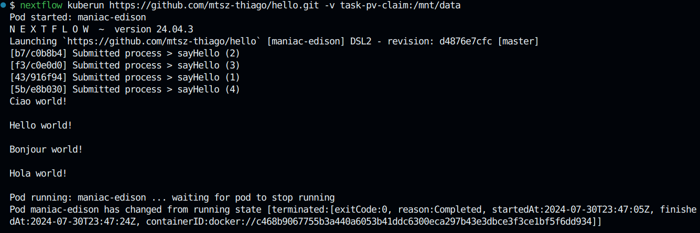

Hello world k8s
====================

## About

This repo is an example of how one can run a Nextflow workflow on a k8s cluster.

## Dependencies

* [Nextflow](https://www.nextflow.io/) - A framework to execute bioinfo pipelines
* [minikube](https://minikube.sigs.k8s.io/docs/) - A quick setup of a kubernetes cluster
* [kubecl](https://minikube.sigs.k8s.io/docs/handbook/kubectl/) - a CLI for kubernetes

## Setup

1. Install all before mentioned dependencies

2. start the minikube cluster

```bash
minikube start
```

3. create a PV (permanent volume)

```bash
kubectl apply -f k8s-resources/pv-volume.yaml
```

4. create a PVC (permanent volume claim)

```bash
kubectl apply -f k8s-resources/pv-claim.yaml
```

5. create a role to allow Nextflow to interact with pod resources

```bash
kubectl apply -f k8s-resources/pod-role.yaml
```

6. bind the created role to *default* service account

```bash
kubectl apply -f k8s-resources/role-binding.yaml
```

## RUN

```bash
nextflow kuberun https://github.com/mtsz-thiago/hello.git -v task-pv-claim:/mnt/data
```

Should output

<p align="center">
  
</p>
